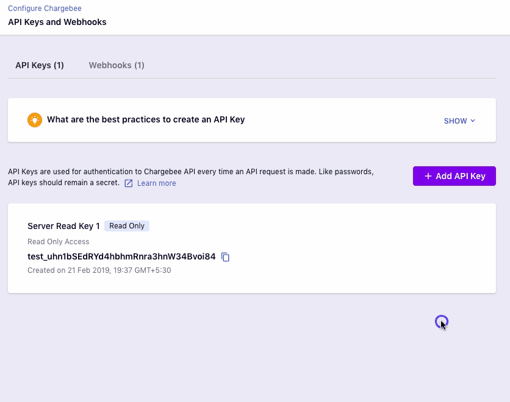
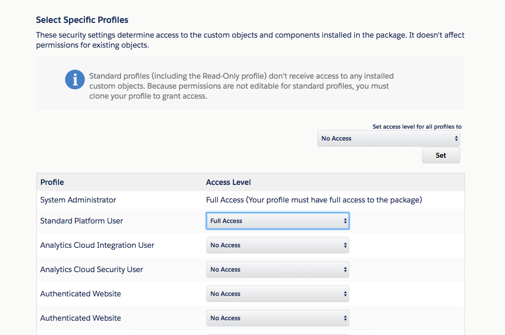

# Broiler Initial page

## Getting Super Powers

Becoming a super hero is a fairly straight forward [process]():

```
$ give me super-powers
```


 Super-powers are granted randomly so please submit an issue if you're not happy with yours.


Once you're strong enough, save the world:

<table>
  <thead>
    <tr>
      <th style="text-align:left">Test</th>
      <th style="text-align:left">test</th>
      <th style="text-align:left">test</th>
    </tr>
  </thead>
  <tbody>
    <tr>
      <td style="text-align:left">
        <p></p>
        <p>Super-powers are granted randomly so please submit an issue if you&apos;re
          not happy with yours.</p>
      </td>
      <td style="text-align:left">
        <p></p>
        <p>Super-powers are granted randomly so please submit an issue if you&apos;re
          not happy with yours.</p>
      </td>
      <td style="text-align:left">
        <p></p>
        <p>Super-powers are granted randomly so please submit an issue if you&apos;re
          not happy with yours.</p>
      </td>
    </tr>
    <tr>
      <td style="text-align:left"></td>
      <td style="text-align:left"></td>
      <td style="text-align:left"></td>
    </tr>
  </tbody>
</table>




&lt;div id="test"&gt;&lt;/div&gt;

test header


sasas






```
// Ain't no code for that yet, sorry
echo 'You got to trust me on this, I saved the world'
```

